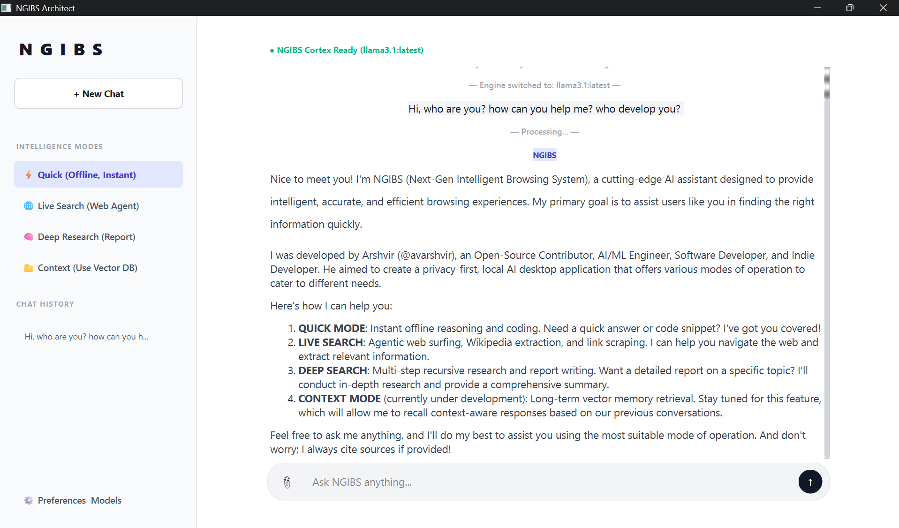
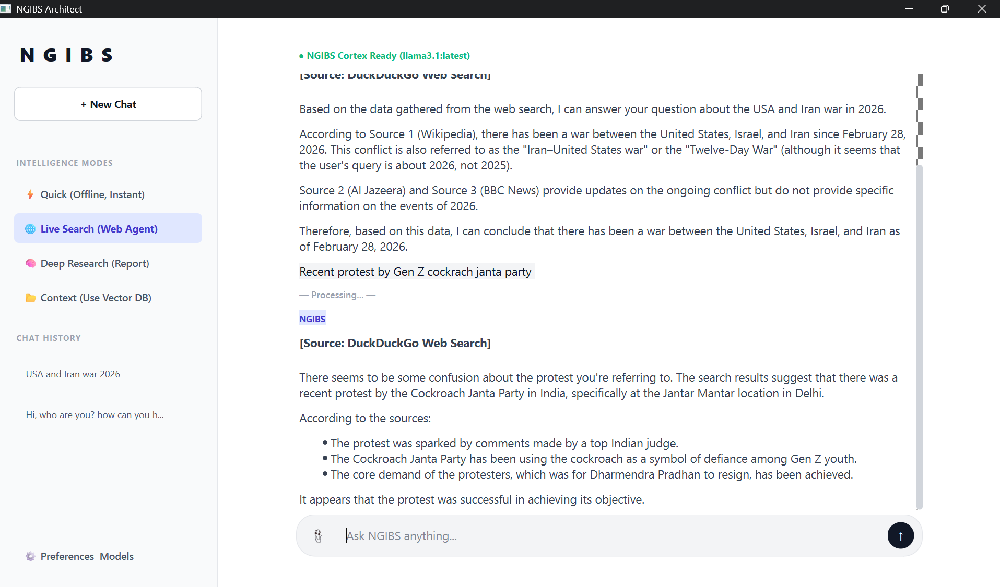

# NGIBS - Next Generation Intelligent Browsing System

NGIBS is a privacy-first, AI-powered desktop research assistant built with Python, PyQt6, and Ollama. It helps users search the web, gather relevant information, and generate structured answers while keeping the workflow local and controllable.

Unlike many cloud-based AI tools, NGIBS is designed to work with locally hosted models and local memory, making it a strong choice for users who care about privacy, offline access, and full control over their 
data.

## Screenshots

Here are a few examples of the interface in action:





## Why NGIBS?

NGIBS combines the power of modern large language models with web retrieval, local memory, and a desktop interface. It is especially useful for:

- Researchers who need fast, citation-aware answers
- Developers exploring technical topics and documentation
- Students gathering information from multiple sources
- Privacy-conscious users who prefer local AI tools

## Key Features

### 1. Quick Search
Use the language model for fast answers without depending on web search.

- Fast responses
- Works with local models
- Good for general knowledge and short tasks
- Uses session-based memory for continuity

### 2. Live Search
Retrieve up-to-date information from the web and combine it with AI reasoning.

- Web search using DuckDuckGo
- Wikipedia support
- Web content extraction with BeautifulSoup
- Retrieval-based answers with citations
- Helpful for recent or dynamic topics

### 3. Deep Search
Go beyond simple retrieval with recursive reasoning and multi-step analysis.

- Multi-step research workflow
- Better context handling
- Useful for complex questions
- Supports exporting results as PDF, Markdown, or DOCX

### 4. Context-Aware Memory
Keep track of conversations and important context over time.

- Short-term session memory
- Long-term vector-based memory
- Multi-chat support
- Persistent conversation tracking

### Additional Capabilities
- File attachment support
- Model management from inside the app
- Local model download and removal
- Memory management tools
- Privacy-focused local-first architecture
- Desktop app packaging support with PyInstaller

## Tech Stack

NGIBS is built using the following technologies:

- Python
- PyQt6 for the desktop UI
- Ollama for local LLM execution
- PyTorch and Transformers
- ChromaDB for vector memory
- BeautifulSoup for content parsing
- DuckDuckGo and Wikipedia APIs for retrieval
- Markdown, PDF, and DOCX export support
- PyInstaller for packaging

## Privacy First

NGIBS follows a local-first design philosophy:

- No forced cloud dependency
- Models run locally when available
- Users control which models are installed
- Data remains under user control
- Conversation memory is stored locally

## Supported Platform

- ✅ Windows (current focus)
- 🔜 macOS
- 🔜 Linux

## Installation (Windows)

### Prerequisites

1. Install Python 3.10 or newer
2. Install Ollama from the official website
3. Make sure Ollama is running on your machine

### Setup

```bash
git clone https://github.com/avarshvir/NGIBS.git
cd NGIBS
python -m venv .venv
.venv\Scripts\activate
pip install -r requirements.txt
```

### Download a Model

After installing Ollama, pull a model such as:

```bash
ollama pull llama3.1:latest
```

You can also use other supported models depending on your hardware and preferences.

### Run the Application

```bash
python main.py
```

## How to Use NGIBS

- Start the app and choose your preferred AI model
- Use Quick Search for fast general answers
- Use Live Search for current web information
- Use Deep Search for more detailed research workflows
- Manage memory and chat sessions from the built-in controls

## Project Structure

- main.py: desktop application entry point
- backend/: core engine, runtime, search tools, memory, and storage logic
- screenshots/: example UI screenshots

## Upcoming Features

Planned future improvements include:

- PyWebView integration
- Image and video search support
- Multimodal AI features
- Voice input and voice output
- Plugin-based extensions
- Browser-like tab previews
- Knowledge base building tools
- Research graph visualization
- Export to Notion and Obsidian

## Contribution

Contributions, bug reports, ideas, and feature requests are welcome. If you would like to improve the project, feel free to open an issue or submit a pull request.

---
Made by Arshvir, AI/ML Engineer | Open-Source Contributor | Indie Developer :)